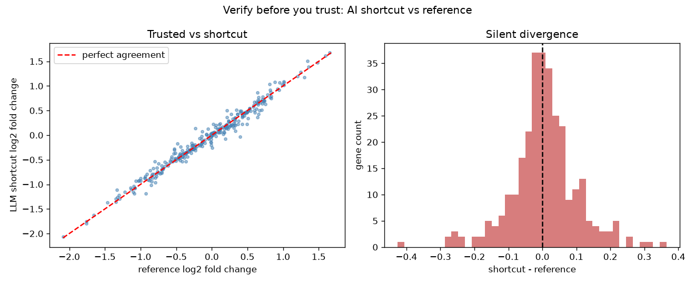

# llm-bioinformatics-code-verifier

An LLM will happily write you a differential expression pipeline in ten seconds. It will just as happily hand you a subtly broken one that runs, produces a plot, and lies to you. Will you be the pilot or the passenger?

This repo is a small harness for *verifying* AI-generated analysis code before you trust its output. The idea: never accept a number from a model you cannot independently sanity-check.

## Demo Output



The plot above was produced from simulated data by `demo.py`, comparing a "trusted" reference statistic against an "LLM-suggested" shortcut to expose where the shortcut silently diverges.

## Why This Exists

Models are fluent, not correct. Fluency is dangerous in bioinformatics because broken code rarely crashes — it returns plausible-looking p-values. The only defence is a verification layer: assertions, invariants, and a reference implementation you can diff against.

## When NOT to Use This

| Situation | Use this harness? |
|-----------|-------------------|
| Prototyping throwaway plots | No, overkill |
| Any result going into a figure or paper | Yes, always |
| You already have a battle-tested pipeline | No, trust that |
| You copy-pasted code from a chatbot | Absolutely yes |

## The Uncomfortable Truth

The verification is the hard part, and the model cannot do it for you. If you cannot state what a correct result should look like, you are not qualified to accept the AI answer either.

## How It Works

1. Define invariants your result MUST satisfy (monotonicity, bounds, symmetry).
2. Keep a slow-but-obvious reference implementation.
3. Run the fast/AI version and assert agreement within tolerance.
4. Log every failure loudly.

Run the checks:

```bash
python verify.py
```

Run the self-contained demo:

```bash
python demo.py
```

## Failure Modes I Have Actually Hit

- Off-by-one in log-fold-change direction (sign flip) that passes visual inspection.
- Normalisation applied twice.
- Silent NaN propagation that a mean() quietly drops.

Each of these would pass "the plot looks fine" and fail a real invariant check.

## Further Reading

Inspired by Ming 'Tommy' Tang, "AI in Bioinformatics: Will You Be the Pilot or the Passenger?" (https://divingintogeneticsandgenomics.com/talk/2026-rsg-nigeria-ai-bioinformatics/).
